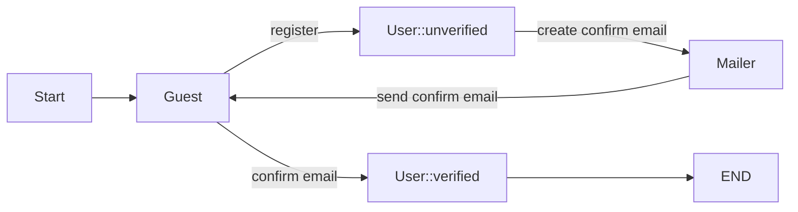
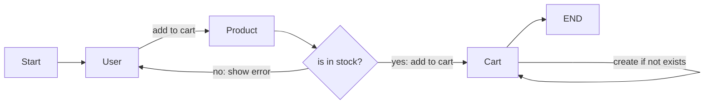
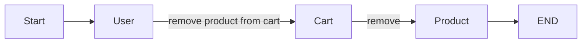
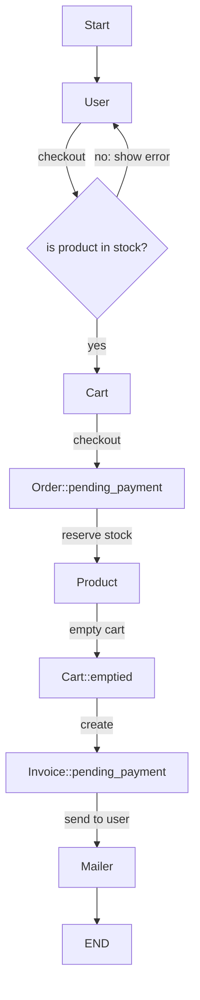
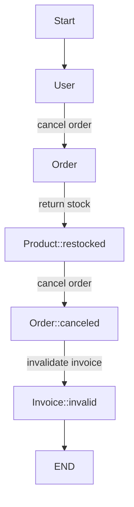
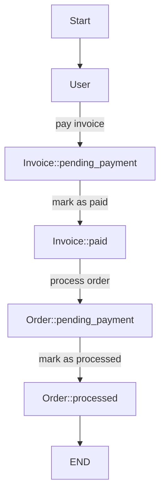

# Commurz

## Usecases

### Register a User
- User is a guest that registered to the system.
- There are two types of user verified and unverified.
- Verified user is a user that has a valid email address.
- Unverified user is a user that has not confirmed his email address.

#### Add Product to Cart
- User can add multiple in stock products to his cart.
- If cart is not available it will create a new cart.
- User cannot add out of stock product to his cart.
- Adding or removing product from a cart does not affect the stock of the product.
- It will reserve the stock of the product when the user do a checkout.

#### Remove Product from Cart
- User can remove a product from his cart.
- Removing a product from the cart does not affect the stock of the product.

#### Checkout
- Checkout is a creating an order from the cart.
- Checkout will reserve the stock of the product.
- Checkout will remove the cart.
- Order is a copy of the cart.
- The price of the order is the latest price of the product in the cart.
- The cart will be emptied after the checkout.
- A pending_payment invoice will be issued to the user after the checkout.
- A user can only checkout if no pending_payment invoice exists.

#### Cancel Order
- User can cancel his order.
- Canceling an order will return the stock of the product.
- Canceling an order will invalidate the invoice.

#### Pay an Invoice
- User can pay a valid invoice.
- Paying an invoice will mark the invoice as paid 
& mark the order as processed.

